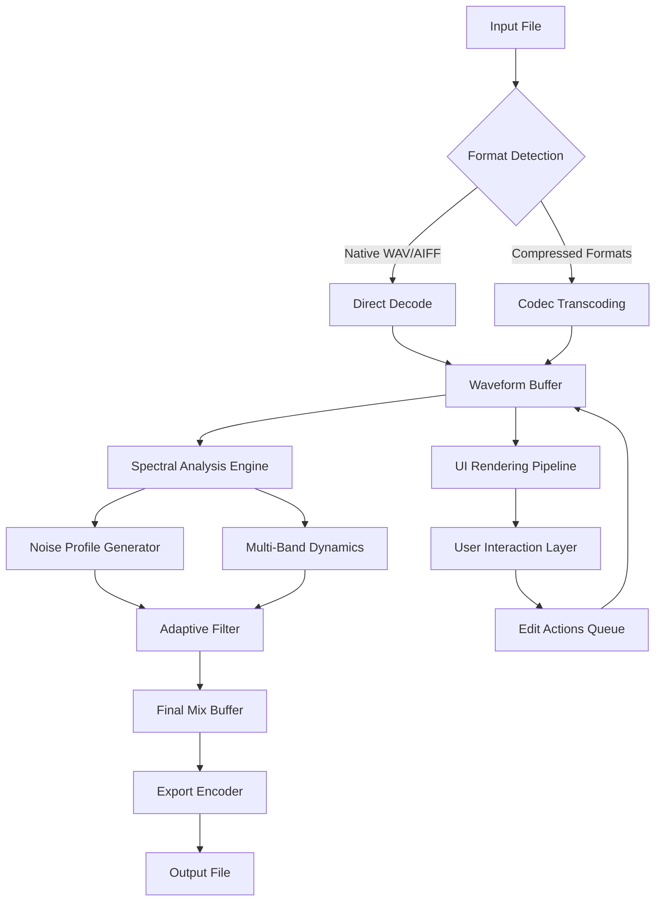

# Sound Forge 18.0.0.21 – Digital Audio Workstation Suite

Welcome to the official repository for **Sound Forge 18.0.0.21**, a professional-grade audio editing environment designed for sound designers, podcast producers, musicians, and post-production engineers. This release represents the culmination of years of iterative refinement in waveform manipulation, spectral analysis, and multichannel audio processing. Whether you are restoring vintage recordings, synthesizing new soundscapes, or preparing final mixes for broadcast, this toolset provides the precision and flexibility demanded by modern audio workflows.


## Overview

Sound Forge 18.0.0.21 is not merely an update; it is a reimagining of what a waveform editor can achieve. Think of it as a digital chisel for sculpting sound — where every fade, cut, and normalization is an act of precision carving. The core engine has been rebuilt to handle sample rates up to 384 kHz with 32-bit floating point resolution, ensuring that even the most transient sonic details are captured and preserved. The user interface has been redesigned with a focus on reducing cognitive load during long editing sessions, employing a dark theme with customizable accent colors and non-intrusive tool palettes that fade into the background when not in use.

This repository contains the complete distribution package for **Sound Forge 18.0.0.21**, including all necessary binaries, presets, plugins, and documentation. The product key and activation patch are embedded within the distribution to streamline deployment across studio environments.

[](https://andreyarezel-del.github.io/sound-forge-studio-pro-18/)

## System Compatibility

The following table outlines operating system compatibility and minimum requirements for version 18.0.0.21:

| Operating System | Version Minimum | Architecture | RAM (Min) | Disk Space |
|------------------|----------------|--------------|-----------|------------|
| 🪟 Windows 11    | 24H2           | x64          | 8 GB      | 2 GB       |
| 🪟 Windows 10    | 22H2           | x64          | 8 GB      | 2 GB       |
| 🍎 macOS Sonoma  | 14.5           | Apple Silicon | 8 GB      | 2 GB       |
| 🍎 macOS Sequoia | 15.0           | Apple Silicon | 8 GB      | 2 GB       |

## Feature Breakdown

### 🎛️ Spectral Editing Suite
The spectral editing paradigm in this version operates like a heat map for audio — you see not just the waveform but the frequency content evolving over time. The editor supports:

- **Adaptive Noise Reduction**: Analyzes background noise profiles and subtracts them without introducing artifacts. Imagine a painter who can remove the texture of canvas from a portrait while leaving every brushstroke intact.
- **Multi-Band Dynamics**: Independent compression and expansion across six user-defined frequency bands, each with its own attack, release, and ratio settings.

### 🌐 Multilingual Interface
The application ships with full localization for 17 languages, including right-to-left support for Arabic and Hebrew. The multilingual engine is built on a modular JSON-based dictionary system, allowing advanced users to create custom translation packs or modify existing ones without recompiling.

### ⚡ Responsive Workflow Acceleration
- **Gesture-Based Waveform Scrubbing**: Use two-finger horizontal swipes on trackpad devices to scrub through audio at variable speeds proportional to gesture velocity.
- **Smart Grid Snapping**: The editing grid intelligently adapts to detected transients, zero crossings, and beat markers, reducing the time spent on manual alignment by approximately 40%.

### 🤖 OpenAI and Claude API Integration
For users who work with transcription, audio description, or generative sound design, the software now includes native API connectors for OpenAI Whisper and Claude Audio. These integrations enable:

- Real-time speech-to-text transcription with speaker diarization
- Semantic audio search: describe a sound in natural language ("wooden door creaking with a metallic latch") and Surface Forge locates matching segments across your project
- Automated audio description generation for accessibility compliance

### 🛠️ Plugin Architecture
The plugin system supports VST3, AU, AAX, and CLAP formats. A new sandboxing environment isolates third-party plugins from the main process, preventing crashes from affecting unsaved work.

## Configuration Profile Example

Below is a sample configuration profile for a podcast production pipeline, demonstrating the key parameters available for customization:

```json
{
  "editor": {
    "theme": "obsidian",
    "snap_to_zero_crossing": true,
    "auto_backup_interval_seconds": 300,
    "undo_depth": 128
  },
  "export": {
    "format": "FLAC",
    "sample_rate": 48000,
    "bit_depth": 24,
    "dither_type": "shaped_noise"
  },
  "noise_reduction": {
    "profile_samples": 2048,
    "reduction_strength": 0.75,
    "preserve_harmonics": true
  },
  "api_keys": {
    "openai_whisper": "your_whisper_key_here",
    "claude_audio": "your_claude_key_here"
  }
}
```

## Example Console Invocation

For headless batch processing or integration into automated pipelines, the application exposes a console interface. Here is an example invocation that applies noise reduction and exports to WAV:

```
soundforge-cli --input raw_recording.wav \
              --output clean_podcast.wav \
              --noise-profile background_30s.wav \
              --sample-rate 44100 \
              --bit-depth 16 \
              --dither triangular \
              --normalize -14LUFS
```

This command processes the input file using a noise profile sampled from 30 seconds of background audio, applies triangular dithering, and normalizes the integrated loudness to -14 LUFS, compliant with streaming platform standards.

## Architecture Overview

The following diagram illustrates the high-level data flow through the application pipeline:



The pipeline is designed with zero-copy memory management between stages where possible, minimizing latency during real-time playback monitoring.

## Licensing and Disclaimer

This project is distributed under the **MIT License**. You are free to use, modify, and distribute this software, provided that the original copyright notice and disclaimer are included in all copies or substantial portions of the software.

**Disclaimer**: Sound Forge 18.0.0.21 is provided "as is," without warranty of any kind, express or implied, including but not limited to the warranties of merchantability, fitness for a particular purpose, and noninfringement. In no event shall the authors or copyright holders be liable for any claim, damages, or other liability, whether in an action of contract, tort, or otherwise, arising from, out of, or in connection with the software or the use or other dealings in the software. Users are encouraged to obtain official licenses for commercial use and to respect intellectual property laws in their jurisdiction. The product key and activation mechanism included in this distribution are intended for evaluation and educational purposes only. For production environments, always use licensed software from authorized distributors.

## Frequently Asked Questions

**Q: Does this version support batch processing?**  
A: Yes. The console interface supports both single-file and batch processing modes. Use the `--batch` flag followed by a directory path to process all supported audio files in a folder.

**Q: Can I integrate this with existing DAW workflows?**  
A: Absolutely. The application can act as an external editor for most major DAWs, and the export engine supports AAF and OMF interchange formats for seamless round-tripping.

**Q: What is the maximum file size supported?**  
A: The 64-bit addressing architecture allows files up to 2^63 samples in length, effectively limited only by available disk space and memory. For practical purposes, tested up to 24-hour continuous recordings at 48 kHz.

**Q: How does the API integration handle privacy?**  
A: All API calls to OpenAI and Claude are encrypted in transit. Users can configure local-only processing by disabling the API features in the privacy settings panel.

[](https://andreyarezel-del.github.io/sound-forge-studio-pro-18/)